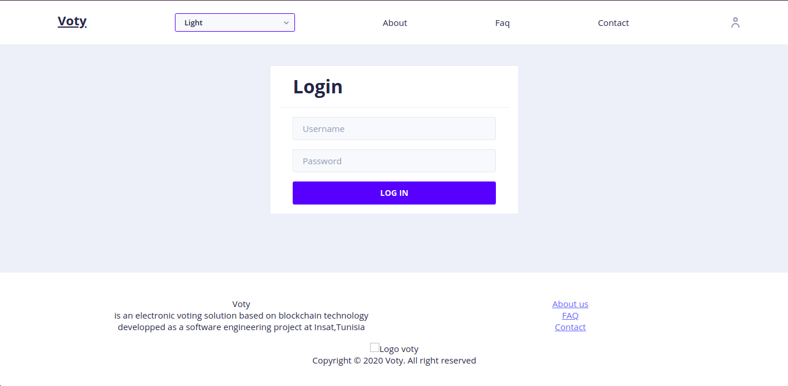
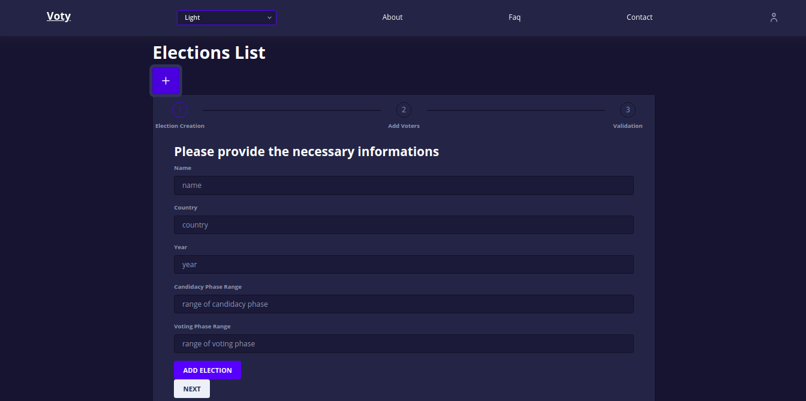
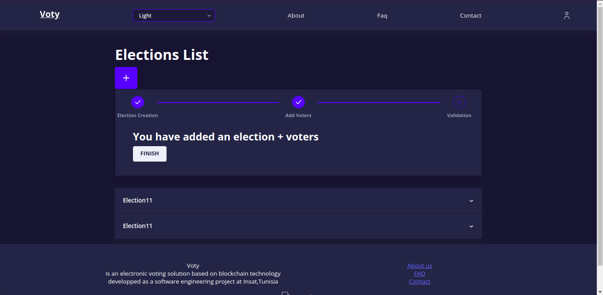
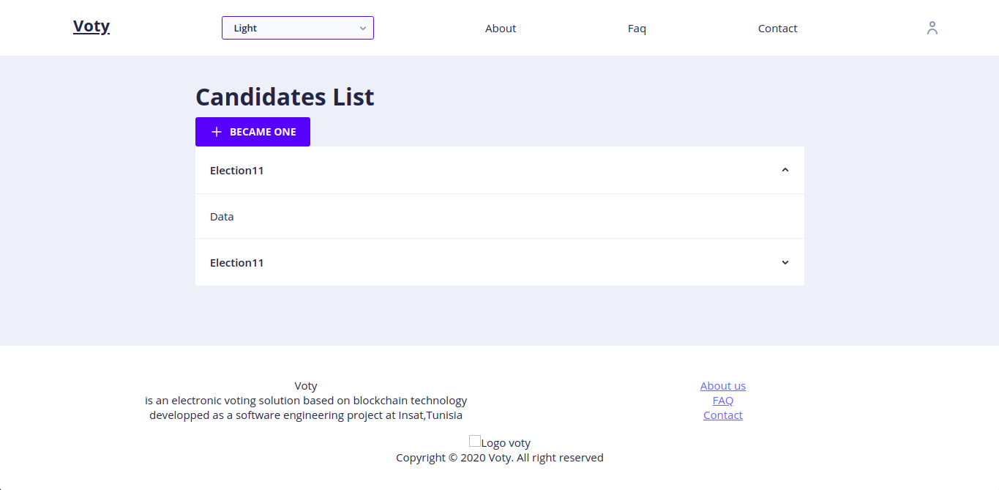
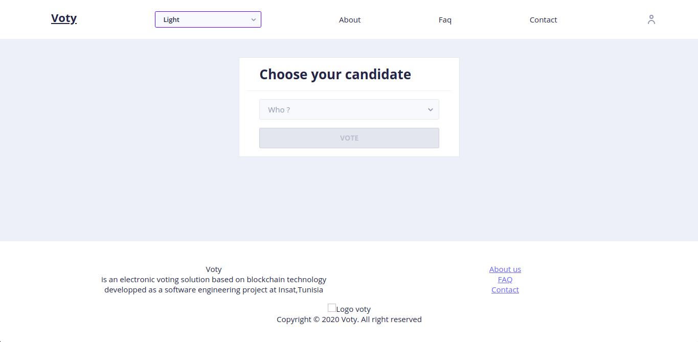

# Voty

### e-vote platform based on blockchain technology.

## About

Voty is our 4th year project at INSAT, Tunisia. We worked on it starting from 15/03/2020 to 12/06/2020, and we successfully presented it to the jury on 29/06/2020 :blush: . We were supervised by our great professor [Mr. Souheib Yousfi](https://dblp.uni-trier.de/pid/32/8559.html) with the assistance of [Ms. Marwa Chaieb](https://dblp.uni-trier.de/pid/233/2607.html). 

## Learning Goals

- Learning the fundamentals of blockchain technology
    - Learning about the distributed ledger technologies
    - Understanding the reasons behind the creation of blockchain
    - Evaluating the pros and cons of DLTs and their use cases
- Getting a hands-on experience with the decentralized app development
    - Use ganache, to implement a DAPP based on Ethereum (public blockchain network) 
    - Use hyperledger fabric, to implement a DAPP within a privileged blockchain network
- Enhancing our web development skills
    - Gain more experience on developing REST API
    - Staying updated with Front-end development

## :hammer: Work plan

The creation of the platform was divided into two phases:

###  PoC development

We started learning about DLTs from scratch, either by reading articles, watching videos from the bitcoin community or getting inspired from Vitalik Buterin's talks   
Then we defined our functional requirement:

- A voter must only vote once.
- A vote is immutable.
- A voter can become a candidate (by provides candidature information).
- A candidate can deactivate his candidature.
- Candidature phase do not overlap with voting phase.   

To create the proof of concept for 'Voty' platform, we had used truffle, ganache, solidity and web3(metamask) to implement the fundamentals features

##### You can check the [PoC demo](https://drive.google.com/file/d/10U0YcuIMCOXYSj50we-0jaUVKjmKapof/view) and it's graphic [design](https://www.figma.com/file/wH2TlAXeM6VQdrT4rss8ZJ/Voty?node-id=0%3A1)

### Voty development

After creating the PoC, Our supervisors  suggested that we target the security concerns, we had to answer the questions:
- Does the app provide security to the user ?
- Does a public blockchain network matches the nature of 'election' (being private, anonymous, etc  ...) ?
- Does the app take into consideration the influence factor (someone forcing a choice on a voter) ? (to be honest, this is a hard question to answer)

After another session of auto learning, we opted to use the Hyperledger Fabric (it supports private networks), which is a part of the Hypeledger project initiated by the Linux Foundation, and has received contributions from IBM, Intel and SAP Ariba.

We added some functional requirement for our platform:

- Each election admin can create multiple elections
- Each election will have a list of members (default voters)
- Each election must be approved by a super admin
- Election results are only accessible after the voting phase

Using Hyperledger Farbic well detailed documentation, we developed our e-vote platform, titled 'Voty'.
##### You can check [Voty demo](https://vimeo.com/429036409)

## :dart: Next ?

There is a lot more to be done with this project, some ideas are:

- Implement different format of vote, like multiple choices, delegating vote, mutable vote, etc
- Emphasis more on security and utilize identity mixer to provide a pure anonymity for the voter
- Transform the platform into a SaaS product
## Screenshots

